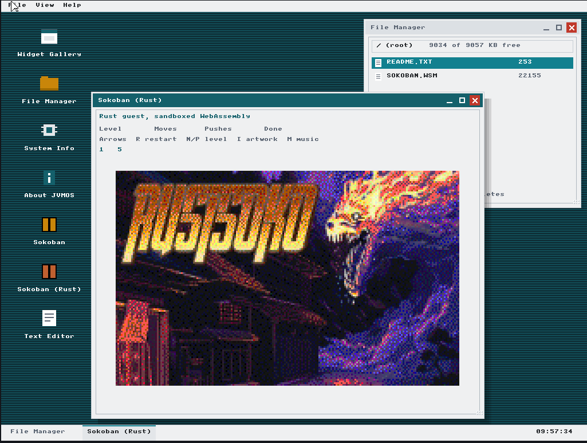
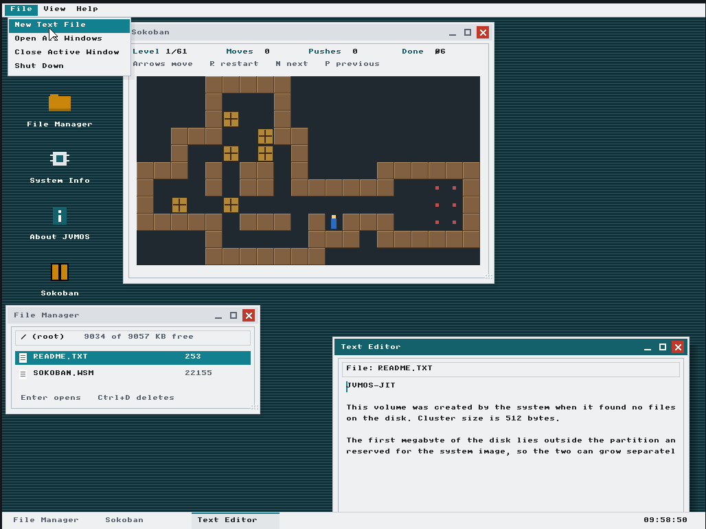

# JVMOS-JIT

A baremetal operating system with no operating system underneath it. The kernel
reads `.class` files and translates their bytecode into x86 machine code
itself, and runs WebAssembly programs beside them in a sandbox.

### Try it in the browser: https://kirindenis.github.io/JVMOS-JIT/

Nothing to install. The page boots the real image in the v86 emulator.

It is an improved fork of https://github.com/aayes89/JVMOS — the boot chain and
the JIT's translator are that project's work.

# What is in it
* A JIT that turns Java bytecode into x86 machine code, with lazy compilation
  and self-patching call sites
* A desktop with icons, resizable windows, menus, a taskbar, keyboard
  navigation and a flat widget set (buttons, checkboxes, radio groups, text
  fields, lists)
* Double buffered VESA graphics with clipping and alpha blended shadows
* A WebAssembly interpreter covering the i32 core of the MVP instruction set,
  with every linear memory access bounds checked
* A FAT32 volume the system mounts at boot, and formats itself if the disk is
  blank, keeping the first megabyte outside the partition for a system image
* Programs loaded from that volume: a `.WSM` file is read off the disk and
  started in the sandbox, with no relocation and no linking
* A text editor, and file associations: Enter on a file opens it in whatever
  handles its extension
* Sound Blaster 16 output with mixed voices, falling back to the PC speaker
* Sokoban, twice: once written in Java and executed by the JIT, once written in
  Rust, compiled to WebAssembly and executed inside the sandbox

# Requirements
* C-Compiler: gcc-12
* Linker: ld
* Assembly: nasm
* Java-Compiler from JDK: javac
* GRUB2
* GIT
* QEMU, to run it outside a browser
* Rust with the `wasm32-unknown-unknown` target, only to rebuild the WASM guest
* Node.js, only to run the tests

# HOW to USE
* clone the repository <code>[git clone](https://github.com/KirinDenis/JVMOS-JIT.git)</code>
* run <code>clear && make clean && make run</code> 
<b>Note:</b> I shared a 10MB image pre-configured for QEMU so you won't have any issues starting it up, but you can run `kernel.bin` if you'd like to test without a hard drive.

# In a browser
Every push to `main` rebuilds `os.iso` in GitHub Actions and publishes it with
`docs/index.html`, which boots the image with the v86 emulator. The page also
shows the kernel's COM1 output, which is the only way to see where boot stopped
when the screen freezes. 
<b>Note:</b> the image is around 12MB and is cached hard, so the page asks the
server for its current version and puts it in the URL. Pressing Reset in the
emulator restarts the machine from the image already in memory; reload the page
to pick up a new build.

# Documentation
* [doc/ARCHITECTURE.md](doc/ARCHITECTURE.md) - boot chain, the JIT, memory map,
  graphics and input
* [doc/JAVA-RULES.md](doc/JAVA-RULES.md) - what this JIT does not support, and
  why breaking those rules fails silently instead of failing loudly
* [doc/WASM-SANDBOX.md](doc/WASM-SANDBOX.md) - the interpreter, the host ABI and
  how to build a guest program
* [doc/FILESYSTEM.md](doc/FILESYSTEM.md) - the FAT32 volume, the system area
  reserved outside the partition, when the system will and will not format a
  disk, and how a program is loaded from it
* [doc/SYSCALLS.md](doc/SYSCALLS.md) - the syscall table
* [doc/TESTING.md](doc/TESTING.md) - how to check changes without building the
  image

# TODO
* More than one program at once. The sandbox has a single slot, so starting a
  program replaces the last one; it needs an array of instances and a host
  context per instance
* An instruction budget per program, so one that never returns cannot hold the
  frame. This is cheap here precisely because WebAssembly is interpreted: the
  interpreter can stop mid-execution and resume next frame, with no timer
  interrupt and no context switch
* A task manager, once those two exist — it can then report measured numbers,
  instructions spent and whether a program yielded or was cut off, rather than
  invented percentages
* Subdirectories and long file names; the volume is 8.3 and root-only
* Giving memory back. The kernel heap is a bump allocator with no free, so
  nothing a program allocates is ever reclaimed
* Networking. The kernel drives an RTL8139 and v86 emulates an NE2000, so the
  network is dead code in a browser
* A JIT for WebAssembly, keeping the interpreter as the reference to test its
  code generation against
* More programs to run: something that draws, and a calculator
